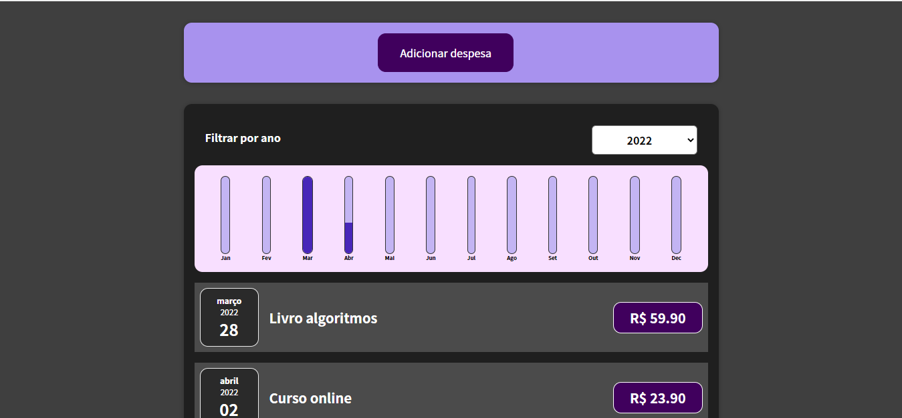

# Expenses Manager
> Um app para gerenciamento de despesas.<br>

[![Build Status][travis-image]][travis-url]

Os dados são persistidos no localStorage do navegador<br>



## Instalação

### Instalar dependências

```sh
npm i
```

### Rodar

```sh
npm start
```

## Deploy
https://paulosrlj-expenses-manager.netlify.app/


[travis-image]: https://img.shields.io/travis/dbader/node-datadog-metrics/master.svg?style=flat-square
[travis-url]: https://travis-ci.org/dbader/node-datadog-metrics

